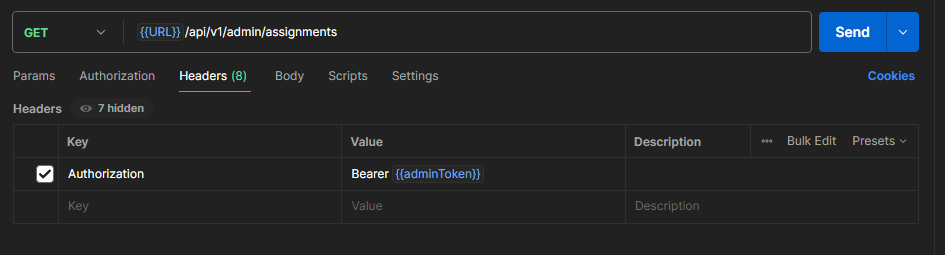

# Assignment Submission Management

This project is an assignment submission management system built with Node.js, Express, and MongoDB. It allows administrators to manage and review assignment submissions from users, and users can upload assignments for review.

## Features

- **Admin Registration and Login**: Admins can register and log in to manage assignments.
- **User Registration and Login**: Users can register and log in to upload assignments.
- **Assignment Management**: Admins can view, accept, or reject assignments submitted by users.
- **Admin Management**: Users can view a list of available admins.

## Tech Stack

- **Node.js** with **Express** for server-side development
- **MongoDB** for database management
- **JWT** for secure authentication
- **bcrypt** for password hashing
- **express-validator** for request validation
- **dotenv** for environment variable management
- **Morgan** for logging in development mode
- **Nodemon** for automatic server restart during development

## Setup Instructions

### Prerequisites

- Node.js (v14 or later)
- MongoDB (local or remote)
- npm (Node Package Manager)

### Installation

1. **Clone the Repository**

   ```bash
   git clone https://github.com/saran-mani/growthx-intern-assignment.git
   cd growthx-intern-assignment
   ```

2. **Install Dependencies**

   Run the following command to install the necessary dependencies:

   ```bash
   npm install
   ```

3. **Environment Variables**

   Create a `.env` file in the root directory and add the following variables:

   ```plaintext
   NODE_ENV=development
   MONGODB_URL='mongodb://localhost:27017/growthxAssignment'
   JWT_SECRET='growthxsecret'
   JWT_EXPIRES_IN='90d'
   ```

   Replace MONGODB_URL with your MongoDB connection string.

4. **Start the Server**

   Run the following command to start the server in development mode:

   ```bash
   npm run dev
   ```

   Alternatively, you can start the server in production mode with:

   ```bash
   npm start
   ```

### API Endpoints

## Postman Collection and Environment

To easily test the APIs, import the following Postman collection and environment:

- [Assignment Management Collection](/GrowthX-Assignment-management.postman_collection.json)
- [Assignment Environment](/GrowthXAssignment.postman_environment.json)
## Important notes

#### Need to set Authorization token in header for user and admin (you can get the  token by login with user and admin credentials)

Please refer the below images
- 
- 

#### Admin

- **Register**: `POST /api/v1/admin/register`

  - Body: `{ "adminId": "Alok", "password": "password", "passwordConfirm": "password" }`

- **Login**: `POST /api/v1/admin/login`

  - Body: `{ "adminId": "Alok", "password": "password" }`

- **Get Tagged Assignments**: `GET /api/v1/admin/assignments`

  - Requires Bearer token in Authorization header.

- **Accept Assignment**: `POST /api/v1/admin/assignments/{assignmentId}/accept`

  - Requires Bearer token in Authorization header.

- **Reject Assignment**: `POST /api/v1/admin/assignments/{assignmentId}/reject`
  - Requires Bearer token in Authorization header.

#### User

- **Register**: `POST /api/v1/user/register`

  - Body: `{ "userId": "Soumik", "password": "password", "passwordConfirm": "password" }`

- **Login**: `POST /api/v1/user/login`

  - Body: `{ "userId": "Soumik", "password": "password" }`

- **Upload Assignment**: `POST /api/v1/user/upload`

  - Requires Bearer token in Authorization header.
  - Body: `{ "adminId": "Alok", "task": "Hello world" }`

- **Get Admins**: `GET /api/v1/user/admins`
  - Requires Bearer token in Authorization header.

## Development

This project uses `nodemon` for development. Any changes made to the code will automatically restart the server.

```bash
npm run dev
```
